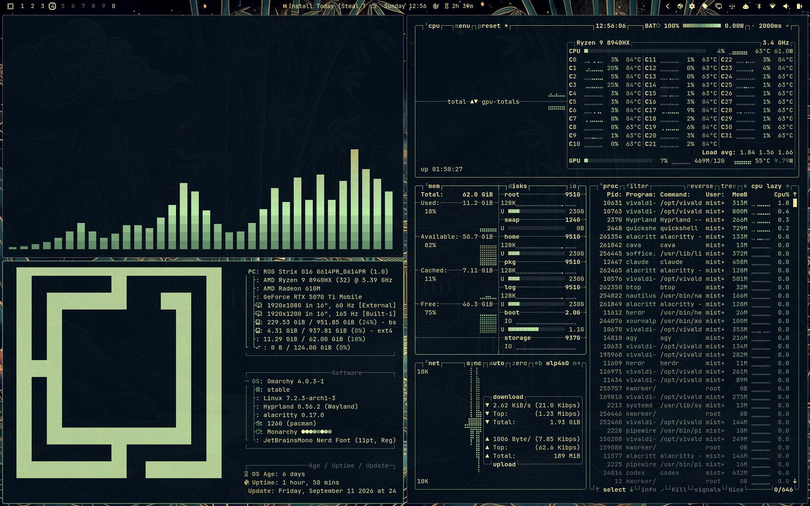
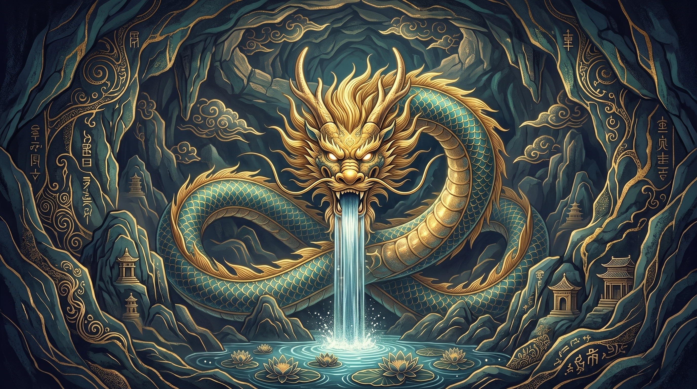
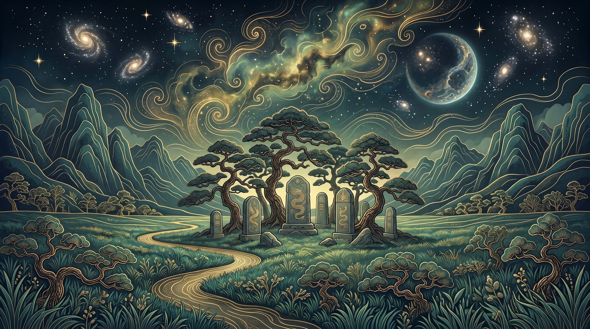
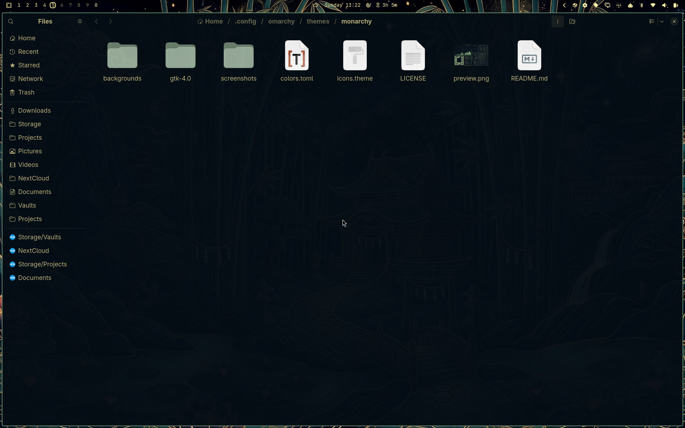
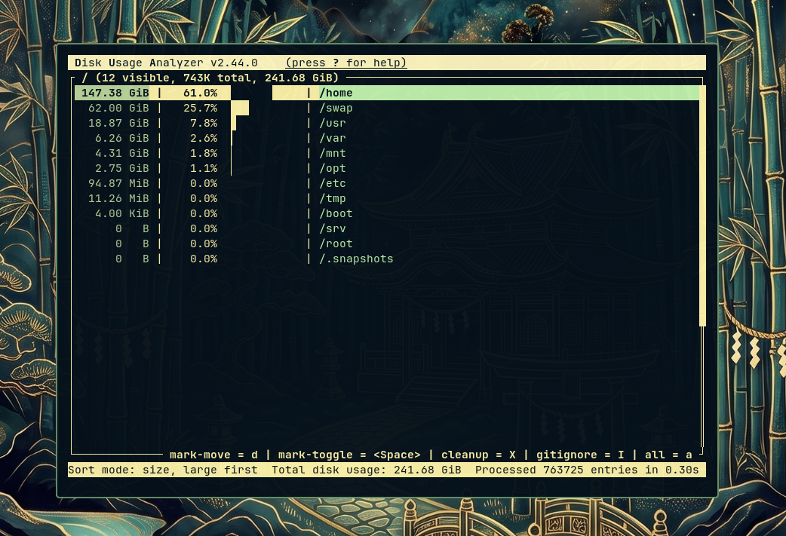

# Monarchy

Monarchy sets a deep imperial-navy backdrop against warm gold and sage
green — dark palace stone lit by lantern light, with jade accents running
through terminals, editors, and the desktop shell alike.

## Preview



## Install

```bash
omarchy theme install https://github.com/MistaMyke/monarchy-omarchy-theme
```

## What's Included

- Native Omarchy theming from `colors.toml` — terminals (Alacritty, Foot,
  Ghostty, Kitty), Neovim, Helix, btop, the browser, VS Code, Obsidian,
  Claude/Pi/Hermes/T3Code CLIs, Hyprland itself, keyboard RGB, and the
  Omarchy shell/bar all pick this up automatically
- GNOME icon theme matching via `icons.theme` (`Yaru-sage-dark`) — applied
  automatically by Omarchy for GTK apps like Nautilus
- A `gtk-4.0/gtk.css` with real background/text colors for GTK4/libadwaita
  apps, since Omarchy doesn't generate GTK styling on its own (see below)
- Six custom wallpapers, generated and refined with Gemini image gen

## Wallpapers

<table>
  <tr>
    <td></td>
    <td></td>
    <td></td>
  </tr>
  <tr>
    <td align="center">Dragon Pond</td>
    <td align="center">Imperial Estate</td>
    <td align="center">Forest Shrine</td>
  </tr>
  <tr>
    <td></td>
    <td></td>
    <td></td>
  </tr>
  <tr>
    <td align="center">Mountain Valley</td>
    <td align="center">Mountain Estate</td>
    <td align="center">Bamboo Villa</td>
  </tr>
</table>

## GNOME / GTK apps (Nautilus, etc.)

Omarchy's built-in theming covers terminals, editors, and other core apps
automatically, plus GNOME's icon theme via `icons.theme` (already included
here — matches this theme's sage-green accent).

This theme also ships a `gtk-4.0/gtk.css` with real background/text colors
for GTK4/libadwaita apps (Nautilus, etc.) — Omarchy doesn't apply this
automatically yet, so copy it into place after installing the theme:

```bash
mkdir -p ~/.config/gtk-4.0
cp ~/.config/omarchy/themes/monarchy/gtk-4.0/gtk.css ~/.config/gtk-4.0/gtk.css
```

Those apps also support a system accent color Omarchy doesn't set
automatically. For a closer match, run:

```bash
gsettings set org.gnome.desktop.interface accent-color green
```

## Screenshots




## Notes

- Accent color is `#658f6a` (sage green); the closest GNOME libadwaita
  named accent is `green`, and the closest installed icon variant is
  `Yaru-sage-dark` — both picked by actual hue comparison, not just a
  rough guess.
- `gtk-4.0/gtk.css` and the `accent-color` command are not applied
  automatically by Omarchy today — see the GTK section above.

## Attribution

- Wallpapers created and refined by [MistaMyke](https://github.com/MistaMyke)
  using Google Gemini image generation
- Made with [Aether](https://github.com/omacom/aether)

## License

MIT
